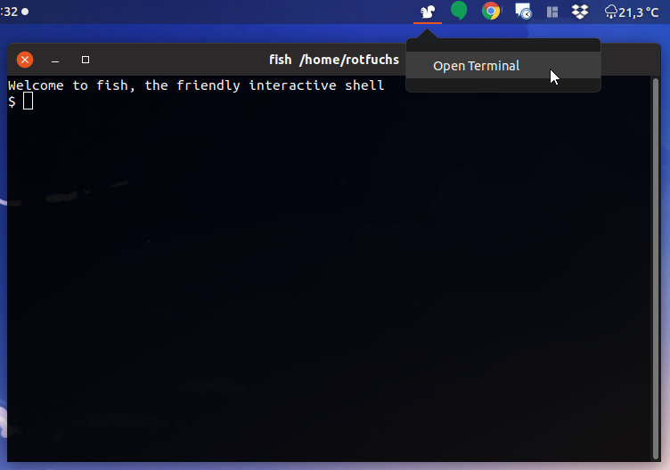

# g3tp-icon-menu

A GNOME 3 extension which add a squirrel to the top menu where you can open the gnome terminal app. 

This is my first step into GNOME 3 extension development. You can use the Code to build your own extension. 

**I don't offer any support. Use at your own risk.**

 
Helpful links for GNOME 3 extension development:
 + [First steps](https://wiki.gnome.org/Projects/GnomeShell/Extensions)
 + [Extension Tutorial](https://wiki.gnome.org/Projects/GnomeShell/Extensions/StepByStepTutorial)
 + [GNOME 3 Api reference](https://developer.gnome.org/references)
 